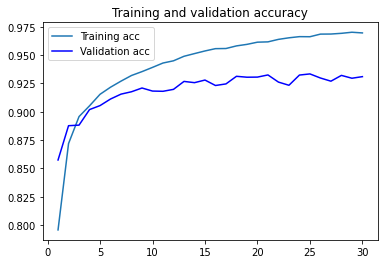
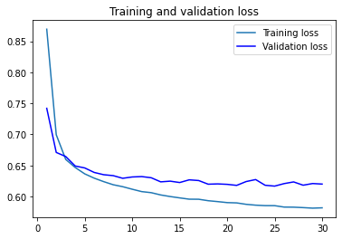

# Fake news detection based on Weibo(microblogs) data during COVID-19

# 1 Description

This is a **Multi-model web rumors detection task**. The goal is to detech fake news or rumor based on a Weibo dataset (Weibo is Chinese Twitter) , which contains text, picture and comments. 

The method is to analysis the correlation between picture and text and input the image and text feature vector into the same space.

# 2 Dataset

The dataset provided by [DataFountain](https://www.datafountain.cn/competitions/422), each data includes Weibo text, comments, picture, domain and fields. There are three categories: **no need to judge, fake news and true news**. The trining set is the data unrelated to the epidemic, and the evaluation set is the data related to the epidemic.

> I also upload the dataset to [google drive](https://drive.google.com/drive/folders/1jj4Z9cQCPC4YzkbKe44TPZcf-todMMlk?usp=sharing).

# 3 Major work
I build a Multimodal fusion web rumors detection model for the image, embedded text in the image and the text of the eassay based on the deep neural networks.

**The major processes:**
- Convert text data to word vector by LSTM.
- Extract feature vector of image data by CNN.
- Add BiLSTM+ATTENTION to improve the accuracy.

# 3 Preliminary result

Classification Accuracy: 96.99%

Loss:0.5816

The training and validation accuracy:

The training and validation loss:

# 4 Insufficient / To do
This is my first project about social media mining and NLP, I will continue to do some work and try some novel method to improve the accuracy.

- Add ResNet to the image feature extraction.

# Paper review list

1. [Gao D, Jin L, Chen B, et al. Fashionbert: Text and image matching with adaptive loss for cross-modal retrieval[C]//Proceedings of the 43rd International ACM SIGIR Conference on Research and Development in Information Retrieval. 2020: 2251-2260](https://arxiv.org/abs/2005.09801).

2. [Jin Z, Cao J, Guo H, et al. Multimodal fusion with recurrent neural networks for rumor detection on microblogs[C]//Proceedings of the 25th ACM international conference on Multimedia. 2017: 795-816.](https://dl.acm.org/doi/abs/10.1145/3123266.3123454)

3. [Cao J, Qi P, Sheng Q, et al. Exploring the Role of Visual Content in Fake News Detection[J]. arXiv preprint arXiv:2003.05096, 2020.]

